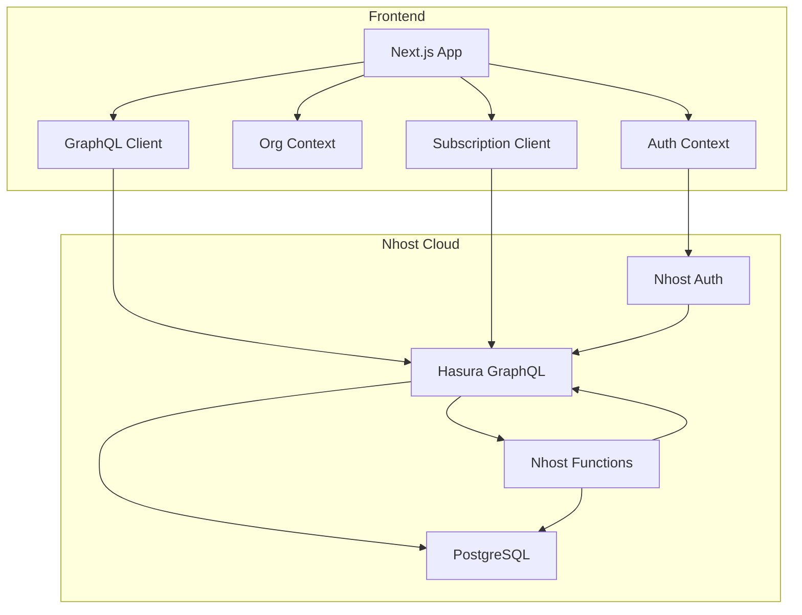

# AI Agent Workflow Builder

A mini n8n-style workflow builder for chaining AI-agent steps (LLM calls, HTTP
requests, controlled DB writes, notifications, conditional branches, and
human-in-the-loop approval gates), built on Next.js + Nhost + Hasura +
PostgreSQL.

## Overview

This project provides a multi-tenant workflow automation platform where organizations can:
- Create and manage workflows with various step types
- Execute workflows with real-time progress tracking
- Implement approval gates for human-in-the-loop processes
- Trigger workflows manually or via webhooks
- Enforce role-based permissions (owner, editor, viewer)
- Monitor usage quotas

## Architecture



## Tech Stack

- **Frontend**: Next.js 16, React 18, TypeScript
- **Backend**: Nhost Cloud (Auth + Hasura + PostgreSQL + Functions)
- **GraphQL**: Hasura with custom Actions
- **Real-time**: GraphQL subscriptions via graphql-ws
- **LLM Integration**: Groq (default model: llama-3.1-8b-instant)

## Setup Instructions

### 1. Create Nhost Project

1. Go to [Nhost.io](https://nhost.io) and create a new project
2. Note your subdomain and region (e.g., `abcxyz.ap-south-1.nhost.run`)

### 2. Deploy Database Schema

1. Copy `nhost/migrations/default/1754750000000_init_schema/up.sql` to Nhost Dashboard → Database → Migrations
2. Apply the migration
3. Verify tables are created: `organizations`, `org_members`, `workflows`, `workflow_steps`, `workflow_triggers`, `workflow_runs`, `step_runs`, `workflow_results`

### 3. Configure Hasura Metadata

1. Copy `nhost/metadata/` contents to Nhost Dashboard → Hasura → Metadata
2. Apply metadata to set up:
   - Relationships between tables
   - Row permissions (Layer 1: org membership, Layer 2: step-level restrictions)
   - Custom Actions (`approveStep`, `triggerWorkflowRun`)

### 4. Set Environment Variables

**Frontend (`.env.local`)**:
```bash
NEXT_PUBLIC_NHOST_SUBDOMAIN=your-subdomain
NEXT_PUBLIC_NHOST_REGION=your-region
```

**Nhost Secrets (Dashboard → Settings → Secrets)**:
- `LLM_API_KEY`: Your Groq API key (get from https://console.groq.com/keys)
- `LLM_MODEL`: Groq model identifier (default: `llama-3.1-8b-instant`)

### 5. Deploy Nhost Functions

1. Copy `nhost/functions/` to Nhost Dashboard → Functions
2. Ensure these are deployed:
   - `actions/approve-step.ts`
   - `actions/trigger-workflow-run.ts`
   - `webhooks/trigger.ts`
   - `organizations/*.ts`

### 6. Run Frontend Locally

```bash
cd frontend
npm install
npm run dev
```

Visit `http://localhost:3000`

### 7. Deploy Frontend (Vercel)

See `DEPLOYMENT.md` for detailed instructions.

## Security

### Organization Isolation

All data is scoped to organizations via `org_id` foreign keys. Hasura row permissions ensure users can only access data from organizations they belong to.

### Role Permissions

- **Owner**: Full access including deletion, webhook triggers, db_write steps
- **Editor**: Can create/edit workflows and steps (except owner-only types)
- **Viewer**: Read-only access

### Layer 1: Row Permissions

Hasura permissions filter queries at the database level:
```graphql
workflows(where: { organization: { members: { user_id: { _eq: $userId } } } })
```

### Layer 2: Step-Level Restrictions

Certain step types are owner-only:
- `db_write`: Only owners can configure (prevents unauthorized data writes)
- `notify`: Only owners can configure (prevents webhook spam)
- `webhook` triggers: Only owners can configure

### Action-Level Authorization

Custom Actions perform additional business logic checks:
- `triggerWorkflowRun`: Verifies user is owner/editor of the org
- `approveStep`: 8-point authorization check (see `SECURITY_TESTING.md`)

See `SECURITY_TESTING.md` for comprehensive cross-org security test results.

## Workflow Execution

### Running a Workflow

1. Create workflow with steps in desired order
2. Click "Run" button (owner/editor only)
3. `triggerWorkflowRun` Action creates a `workflow_runs` row
4. Runner executes steps sequentially in `step_order`

### Step Types

- **llm_call**: Calls LLM API with prompt, returns text response
- **http_request**: Makes HTTP request with configurable method/headers/body
- **db_write**: Writes step output to `workflow_results` table (owner-only)
- **notify**: POSTs to webhook URL with message (owner-only, non-fatal)
- **conditional_branch**: Evaluates condition, can skip ahead if false
- **approval_gate**: Pauses workflow, requires human approval to resume

### Approval Gate State Machine

```
running → paused (approval_gate step)
         ↓
    [approveStep Action]
         ↓
    running (resumes from next step)
```

### Retry Logic

- LLM and HTTP steps retry once on failure
- Notify steps are non-fatal (errors logged but don't fail the run)
- Failed steps set workflow_run status to "failed"

### Real-Time Updates

GraphQL subscriptions provide live step status updates:
```graphql
subscription StepRunUpdates($workflowRunId: uuid!) {
  step_runs(where: { workflow_run_id: { _eq: $workflowRunId } }) {
    id
    status
    output
    error
  }
}
```

Status badges update automatically without page refresh:
- Completed
- Running
- Waiting for approval
- Failed
- Skipped

## Webhook Triggers

Workflows can be triggered externally via webhook:

1. Create webhook trigger with auto-generated token
2. POST to: `https://<subdomain>.functions.<region>.nhost.run/v1/webhooks/trigger?token=<token>`
3. Workflow executes with `trigger_type: "webhook"`
4. No user session required (token-based auth)

## Known Limitations

1. **Synchronous Execution**: Workflow runs execute synchronously within Nhost Function timeout (currently ~60s). Long-running workflows may timeout. Future enhancement: use background jobs.

2. **Conditional Branch Simplification**: Skip logic uses simple step_order comparison rather than complex graph traversal. Works for linear workflows but may not handle complex branching scenarios.

3. **No Retry Configuration**: Retry count is hardcoded to 1. Future: make configurable per step.

4. **No Step Parallelization**: Steps execute sequentially. Future: support parallel step execution.

5. **CORS**: Currently set to `*` for development. Should be tightened to specific frontend origin in production.

## Phases Completed

- [x] Phase 1 — Database schema + migrations
- [x] Phase 2 — Hasura relationships & Layer-1/Layer-2 row permissions
- [x] Phase 3 — Nhost authentication
- [x] Phase 4 — Organization and role permissions
- [x] Phase 5 — Workflow CRUD
- [x] Phase 6 — Workflow runner
- [x] Phase 7 — `triggerWorkflowRun` Action
- [x] Phase 8 — LLM + HTTP steps
- [x] Phase 9 — Conditional branching
- [x] Phase 10 — Approval pause/resume
- [x] Phase 11 — GraphQL subscriptions
- [x] Phase 12 — Webhook trigger
- [x] Phase 13 — Frontend workflow builder
- [x] Phase 14 — Usage/quota
- [x] Phase 15 — Cross-org security testing
- [x] Phase 16 — Deployment
- [x] Phase 17 — README + write-up + demo recording

## Repo Structure

```text
ai-workflow-builder/
├── frontend/
│   ├── app/                    # Next.js app router pages
│   ├── components/             # Reusable components
│   ├── graphql/                # GraphQL queries/mutations
│   ├── hooks/                  # Custom React hooks
│   ├── lib/                    # Utilities (nhost client, contexts)
│   └── types/                  # TypeScript type definitions
├── nhost/
│   ├── functions/
│   │   ├── actions/            # Hasura Action handlers
│   │   ├── webhooks/           # Webhook trigger handler
│   │   └── organizations/      # Org management functions
│   ├── migrations/             # Database migrations
│   ├── metadata/               # Hasura metadata (permissions, actions)
│   └── config.yaml             # Nhost configuration
├── SECURITY_TESTING.md         # Cross-org security test results
├── DEPLOYMENT.md               # Deployment guide
├── ARCHITECTURE.md             # Conceptual architecture write-up
└── README.md                   # This file
